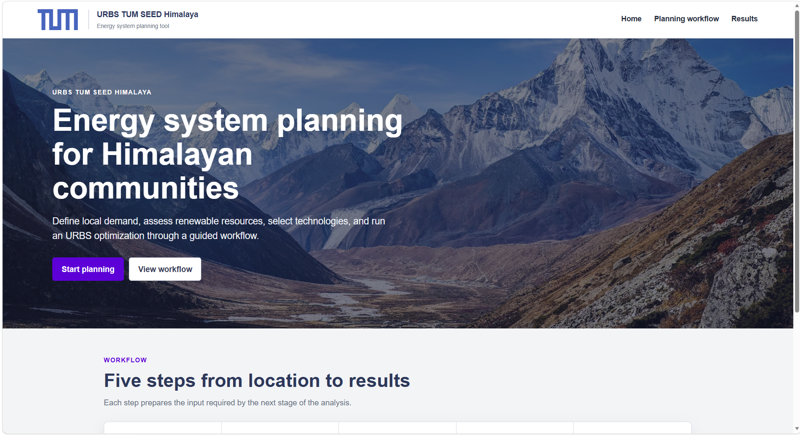
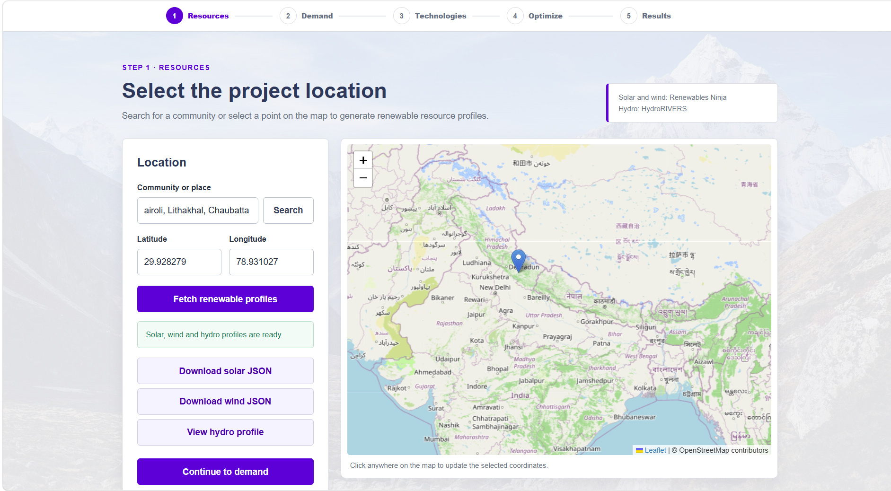
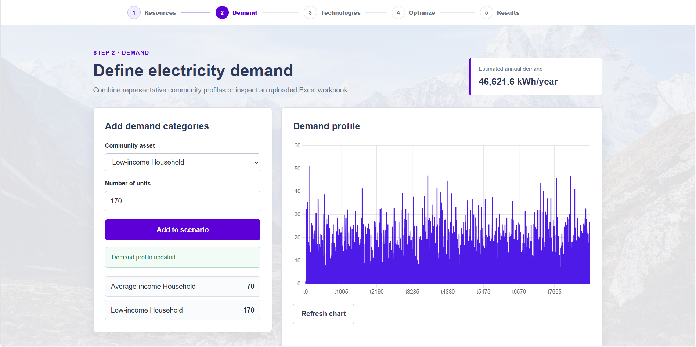
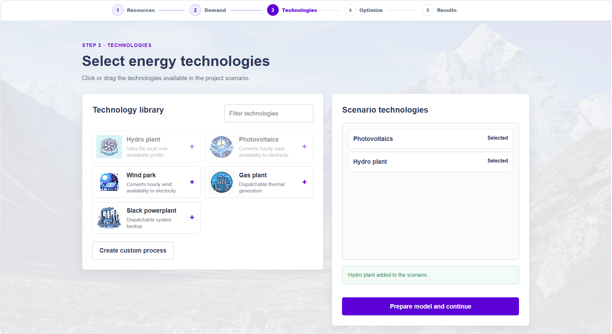
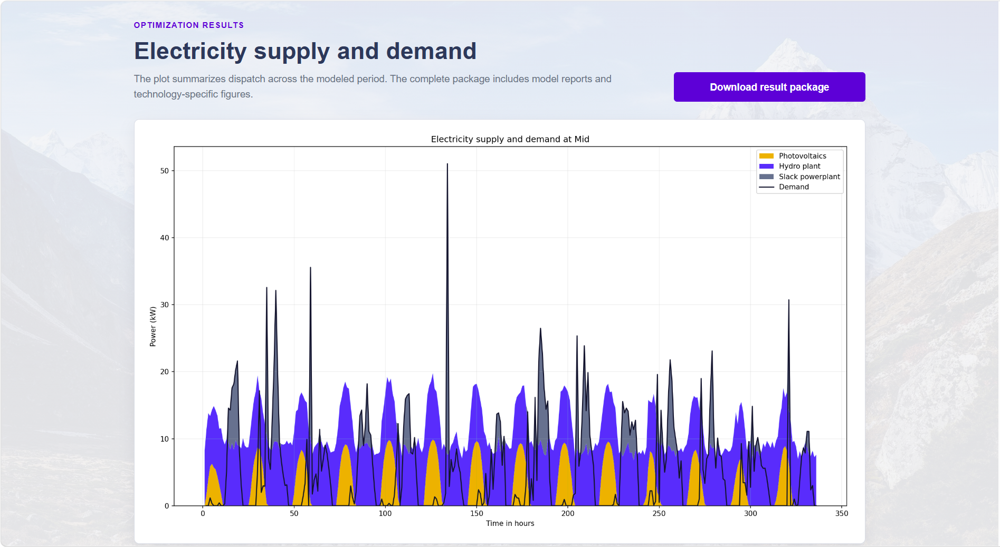

# URBS TUM SEED Himalaya

URBS TUM SEED Himalaya is a Flask-based web application for energy system
development planning. It helps users define a local study area, collect or
prepare input data, estimate electricity demand, select renewable and
technical processes, and run an [URBS](https://urbs.readthedocs.io/en/latest/) optimization model to generate a
least-cost energy system scenario. The project was originally designed together with the Chair of Renewable and Sustainable Energy Systems at the Technical University of Munich to support NGOs and local stakeholders in planning energy systems for rural Himalayan communities.

<p align="center">
  
</p>

## How the Application Works

The website guides the user through a practical planning workflow. Each step
prepares data required by the next one, ending with an optimized electricity
supply scenario and a downloadable result package.

### Step 1: Fetch Local Data from the Map

The user searches for a community or selects a point on the map. The
application uses the selected coordinates to prepare location-dependent
resource inputs:

- solar and wind profiles from Renewables Ninja;
- nearby river information from the local HydroRIVERS dataset;
- an estimated hourly hydro availability profile.

A Renewables Ninja API token is required to retrieve solar and wind data. If
the HydroRIVERS dataset is unavailable, the application can continue with
hydro availability set to zero.

<p align="center">
  
</p>

### Step 2: Calculate Electricity Demand

The user defines the number and type of community consumers, including
households, schools, and primary health-care centers. The application combines
the corresponding representative Excel profiles into an hourly electricity
demand series.

The page displays the estimated annual demand and its time profile. A separate
Excel workbook can also be uploaded to inspect the sum of its first column.

<p align="center">
  
</p>

### Step 3: Prepare Process Inputs

The user selects technologies from the process library by clicking or dragging
them into the scenario area. Available options include hydro, photovoltaics,
wind, gas generation, and the slack powerplant used as a high-cost backup.

The application converts the selected technologies and their
process-commodity relationships into the JSON structure expected by URBS.
Custom processes can also be entered, but they require valid technical and
commodity relationships before scientific use.

<p align="center">
  
</p>

### Step 4: Run the Optimization and Inspect Results

URBS solves the configured hourly least-cost scenario with Pyomo and the
`appsi_highs` solver by default. The model determines technology capacities and
hourly dispatch while balancing electricity supply and demand.

After the optimization finishes, the results page displays the electricity
mix and demand curve. Photovoltaics, wind, hydro, and slack generation are
shown separately when they are present in the scenario.

<p align="center">
  
</p>

## Outputs

Each run creates a timestamped directory under:

```text
result/single-year-<timestamp>/
```

The output can include:

- optimized process capacities;
- hourly electricity supply and demand;
- technology-specific figures;
- Excel reports;
- HDF5 model output;
- PDF and PNG plots;
- a downloadable ZIP package containing the generated results.

The slack powerplant remains available as an expensive feasibility backup. It
supplies electricity only when the selected technologies and resource profiles
cannot meet demand at lower total cost.

## Project Structure

```text
app/
  __init__.py          Flask application factory
  config.py            Paths and environment configuration
  routes/              Page and API blueprints
  services/            Demand, renewable, process, and URBS services
  templates/           Jinja templates
  static/              CSS, JavaScript, and website images
demand_data/           Representative hourly demand profiles
static/hydrorivers/    HydroRIVERS shapefile and sidecar files
urbs_master/           Bundled URBS model and JSON inputs
tests/                 Route and service tests
run.py                 Recommended application entry point
app.py                 Backward-compatible launcher
```

## Installation

Python 3.12 or 3.13 is recommended.

### Windows PowerShell

```powershell
cd "C:\path\to\completesite"
python -m venv .venv
.\.venv\Scripts\Activate.ps1
python -m pip install --upgrade pip
python -m pip install -r requirements.txt
```

If PowerShell blocks virtual environment activation:

```powershell
Set-ExecutionPolicy -Scope Process -ExecutionPolicy Bypass
.\.venv\Scripts\Activate.ps1
```

### Conda

```powershell
conda create -n urbs-himalaya python=3.12 -y
conda activate urbs-himalaya
python -m pip install -r requirements.txt
```

## Configuration

Copy `.env.example` to `.env` and replace the placeholder values. `run.py`
loads this file automatically.

```env
FLASK_SECRET_KEY=replace-with-a-long-random-value
RENEWABLES_NINJA_TOKEN=replace-with-your-renewables-ninja-token
HYDRORIVERS_PATH=
URBS_SOLVER=appsi_highs
FLASK_HOST=127.0.0.1
FLASK_PORT=5000
FLASK_DEBUG=0
```

A token can be obtained from
[Renewables Ninja](https://www.renewables.ninja/).

Place the HydroRIVERS shapefile and its sidecar files in:

```text
static/hydrorivers/HydroRIVERS_v10_as_clipped2_rpj.shp
```

Keep the `.shp`, `.shx`, `.dbf`, and `.prj` files together with the same base
name. The large `.shp`, `.shx`, and `.dbf` files are intentionally excluded
from Git and must be installed locally. Alternatively, set
`HYDRORIVERS_PATH` to another local `.shp` file. If the dataset is unavailable,
the web workflow continues with hydro availability set to zero.

## Run the Application

```powershell
python run.py
```

Open <http://127.0.0.1:5000> in a browser.

The legacy command remains available:

```powershell
python app.py
```

## Required Demand Data

The following workbooks must remain in `demand_data/`:

- `poor_household.xlsx`
- `average_household.xlsx`
- `rich_household.xlsx`
- `hospital.xlsx`
- `school.xlsx`

The first column of each workbook is interpreted as an hourly demand profile.

## Run URBS Directly

After the generated inputs are available in `urbs_master/Input/json/`, the
model can be executed without the web interface:

```powershell
python urbs_master\run_single_year.py
```

## Tests

```powershell
pytest -q
```

The tests cover primary routes, demand aggregation, coordinate validation,
hydro profile generation, renewable JSON transformation, and URBS input
preparation.

## Troubleshooting

### Renewables Ninja token is not configured

Set `RENEWABLES_NINJA_TOKEN` in `.env`, then restart the Flask application.

### HydroRIVERS cannot be read

Confirm that all shapefile components are present and fully downloaded. When
using OneDrive, mark the project directory as **Always keep on this device**.
Alternatively, set `HYDRORIVERS_PATH` to another local `.shp` file.

### Solver is unavailable

Reinstall Pyomo and HiGHS in the active environment:

```powershell
python -m pip install --upgrade pyomo highspy
```

### Optimization is infeasible

Check process capacity limits, commodity definitions, and
process-commodity relationships. The application adds a high-cost slack
powerplant as a fallback, but invalid or incomplete model inputs can still
prevent a valid optimization run.
